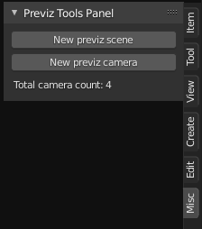
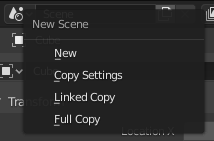
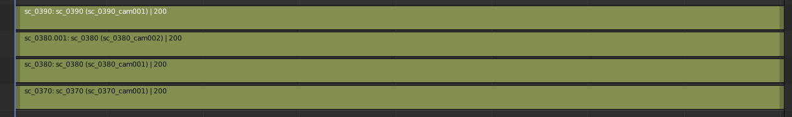
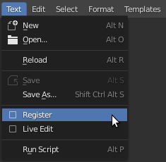

# Blender previz tools

This is a collection of python scripts for Blender that I have been using lately while working on the previz for a short animated film.

To make things clear, this is not an addon or anything. It has the potential to be an addon, but I currently don't have enough time to develop it into one. It is not even going to just work out of the box. There are a few things that you might need to be aware of to use these scripts.

However, I still would like to share these scripts because I think they provide an insight into one possible workflow for creating previz in Blender. They can also serve as a good starting point for anyone who want to use them.

These scripts are divided into two groups:

1) A panel that appears in the properties sidebar (toggled using the `n` key) of the 3D view.
2) Two scripts that generate and render all cameras in all available scenes within a Blender file.
   
## The 3D View Panel

As you can see, the `Previz Tools Panel` appear in the `Misc` tab of the properties sidebar. It includes two buttons and counter for all the cameras used in the Blender file across all scenes.

The first button creates a new scene, sets the name based on the criteria defined in the `new_previz_scene_operator.py` script.

> **NOTE:**  
> At the moment, you will need to have at least 1 scene in your Blender file that follows the naming convention defined in the script.

The naming convention I have been using in the project follows the format `sc_####`. `Scene 1` actually gets the number `10`, so scene 1 would be called `sc_0010`. This is to allow some room for adding new scenes between scenes if required.

Once you have a scene in the file that follows that naming convention, you will be able to use the panel to create other scenes after it.

The new scenes will copy the settings of that first scene, so you will need to define all your settings first before you start creating scenes, or you will have to change them manually.

However, at the moment, if you need to add a scene between two scenes, you will have to do that manually. So, if, for instance, you have `sc_0010` and `sc_0020`, and you realised that you need another scene in between called `sc_0015`, you will have to create it yourself.

When a new scene is created, the script will also create two collections in it, one for the objects and one for the camera.

The other button in the panel creates a new camera in the active scene. This is defined in the `new_camera_operator.py` script.

The new camera will get a name based on the following format: `<SCENE>_cam###` with `<SCENE>` replaced with the name of the active scene. So, if you have a scene called `sc_0010` with no camera, and you click the `New previz camera` button, a camera called `sc_0010_cam001` will be created.

> NOTE:  
> When using these scripts, it is better not to create cameras manually in your scenes, unless you give them names that tightly follow the naming convention defined in the script. Otherwise, the scripts might not work as expected.  
> This is currently one of the limitation of these scripts that could be addressed later.

All the settings and naming conventions are defined in the scripts and can be easily changed if you like. The scripts are thoroughly commented to explain what everything does, so if you are familiar with Python and Blender's API, you should be good to go.

> NOTE:  
> In both files (`new_previz_scene_operator.py` and `new_camera_operator.py`) all you will need to change is the `main(context)` function. This is what controls the actual functionality of the scripts. The other parts in each script define the operators so Blender can find them, so you shouldn't change them unless you are familiar with creating Blender operators. Otherwise, the scripts will stop working.

___

## The Sequencer Tools

These simple two scripts (`generate_strips_2.8_basic.py` and `render_strips_2.8_basic.py`) create a sequencer strip for each camera in a scene, then render all these strips to the render filepath defined by you.

So, let's say you have a scene called `sc_0010` that has `5` cameras in it. When you run the `generate_strips_2.8_basic.py` script, you will find `5` strips in the sequencer, one for each camera.

When you run the `render_strips_2.8_basic.py` script, it will go to the render file path you selected in the render settings, create a folder called `sc_0010`, and, in that folder, create `5` folders using the camera names as folder names.

The rendering script can render both a `final` and an `OpenGL` render. Unless really necessary, I usually stick to the `OpenGL` renders because they go much faster than a final render from `EEVEE` or `Cycles`.

___

## How to Use These Scripts

### Sequencer

The `sequencer` scripts are very simple to use. All you need to do is load them in Blender's script editor and click the `run` button (or use the shortcut `Alt+P`) for each one of them.

The one thing you will need to know here is that Blender doesn't allow a scene to include a strip for itself in the sequencer. So, when it is time to render all your previz scenes, create a new scene for rendering.

> NOTE:  
> When you create the render scene, make sure to copy the settings of the active scene, or the render scene will use completely different render settings to the ones you defined for the previz.
> The way you do that is very simple. In the `New Scene` menu, choose `Copy Settings` instead of `New`.  
> 
> 

Once you do that and run the `generate_strips_2.8_basic.py` script, the sequencer will look something like this.

> NOTE:  
> If your scenes have different durations, that will be respected. It just happens that the sample scenes I have are all of the same duration.

> WARNING:  
> Currently, Blender's sequencer supports only `32` strips on top of each other. If you use, the same workflow I use when working on previz, you will find that you will definitely have more than `32` cameras and, therefore, more than `32` strips. The way I work around this limitaion is by splitting my previz into separate files. This is the reason I have the camera counter in the panel.  
> 
>    
> This way I can keep an eye on it to make sure I don't go beyond the limit.

### 3D View Panel

The `3D View panel` scripts require a little bit of setup, but they are still pretty simple to use.

Once you create and **save** your previz file, load all of these scripts into Blender's text editor.

Then you will have to do the following for all `3` scripts (`new_camera_operator.py`, `new_previz_scene_operator.py` and `previz_tools_panel.py`):

* In the `Text` menu of the script editor, check the `Register` option.
* Once you have done this for the `3` scripts, save the file.

Now, whenever you open the file, these scripts will be run automatically, and you will get the panel in the 3D view.

> NOTE:  
> You don't have to do these steps if you don't want to, but keep in mind that, unless you do that, you will have to run all `3` scripts in the proper order every time you open the file. So, for convenience, it is better to register them, so they are run automatically when you open the file.

> NOTE:  
> These setup steps do not mean that the panel will be available in every new Blender scene. We have registered it for the Blender file where you saved it. If you would like the panel to show up by default when you start Blender, you will need to open a new scene, run through the setup steps described above, and then save that scene as a default.